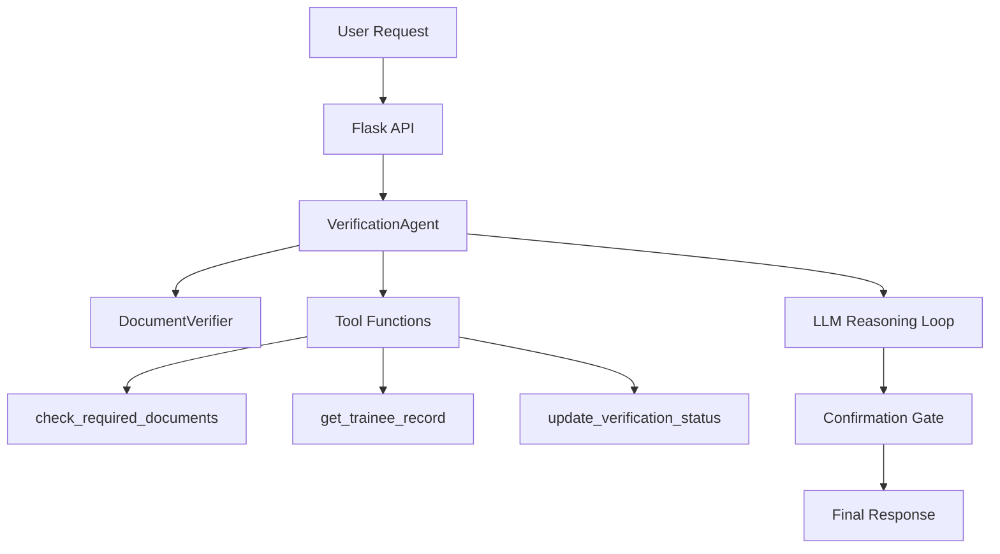

# Trainee Document Verification Agent

This project demonstrates an agent-style trainee document verification workflow. The system uses a Flask API, a verification agent, an LLM client, and tool-like functions to review trainee document submissions and decide whether verification should proceed or pause for confirmation.

## What this project demonstrates

This is a demo-friendly implementation of an AI agent that can:

1. Receive a verification request.
2. Review the submitted document payload.
3. Check required documents and trainee information.
4. Decide whether it should ask for confirmation before changing status.
5. Return a structured result to the caller.

## Project structure

```text
app/
├── agents/
│   └── verification_agent.py
├── services/
│   ├── document_verifier.py
│   └── llm_client.py
├── functions.py
├── prompts.py
├── tools.py
├── main.py
└── config.py

tests/
└── test_verification_agent.py
```

## Installation

1. Install dependencies:

```bash
pip install -r requirements.txt
```

2. Run the app:

```bash
python app/main.py
```

3. The app will be available at:

```text
http://127.0.0.1:5000/
```

## Agent workflow



## API usage

### Verify documents

Endpoint:

```text
POST /verify
```

Example request:

```json
{
  "name": "Rahul Sharma",
  "id": "101",
  "documents": ["aadhaar", "resume", "degree_certificate"]
}
```

Example response:

```json
{
  "status": "pending",
  "message": "Required documents are missing.",
  "missing_documents": ["pan"],
  "needs_confirmation": true
}
```

### Confirm verification

```json
{
  "name": "Rahul Sharma",
  "id": "101",
  "documents": ["aadhaar", "resume", "degree_certificate", "pan"],
  "confirm": true
}
```

## Sample demo script

1. Start the app with `python app/main.py`.
2. Send a verification request to `/verify` with a trainee ID and a few documents.
3. Notice that the agent identifies which documents are missing.
4. If the document set is complete, the agent pauses for confirmation before updating the status.
5. Show the final response returned by the Flask API.

## Testing

Run the regression tests with:

```bash
python -m pytest -q tests/test_verification_agent.py
```

## Notes

This project intentionally uses mock data and mock tool behavior to keep the focus on the agent architecture, tool calling, reasoning loop, and confirmation flow rather than on production infrastructure.
