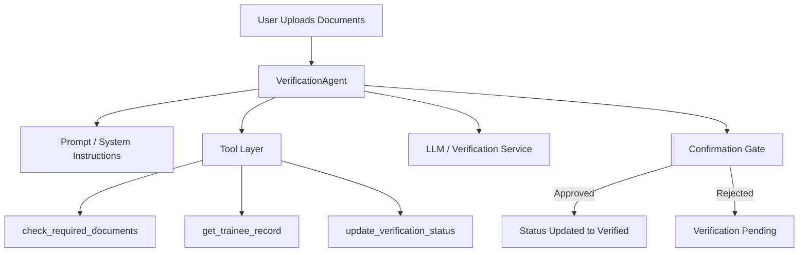

# Trainee Document Verification System

This project implements a trainee document verification system using a language model. The system is designed to verify the authenticity of documents submitted by trainees, ensuring that all necessary information is accurate and valid.

## Project Structure

```
trainee-document-verification-agent
├── app
│   ├── __init__.py
│   ├── main.py
│   ├── config.py
│   ├── agents
│   │   ├── __init__.py
│   │   └── verification_agent.py
│   ├── services
│   │   ├── __init__.py
│   │   ├── llm_client.py
│   │   └── document_verifier.py
│   ├── models
│   │   └── __init__.py
│   └── utils
│       └── __init__.py
├── tests
│   └── test_verification_agent.py
├── requirements.txt
├── .env.example
└── README.md
```

## Installation

1. Clone the repository:
   ```
   git clone <repository-url>
   cd trainee-document-verification-agent
   ```

2. Install the required dependencies:
   ```
   pip install -r requirements.txt
   ```

3. Set up environment variables by copying `.env.example` to `.env` and filling in the necessary values.

## Usage

To run the application, execute the following command:
```
python app/main.py
```

## Features

- Document verification using a language model.
- Validation of trainee data.
- Modular architecture with separate components for agents, services, and utilities.

## Simple Architecture Diagram



## Demo Script

1. Start the app with `python app/main.py`.
2. Submit a trainee document payload through the `/verify` endpoint.
3. Observe that the agent checks the submitted documents and trainee record.
4. See that it pauses for confirmation before changing the verification status.
5. Confirm the action and observe the final verified state.

## Assignment Summary

This project demonstrates a simple agent-based document verification workflow. It uses a system prompt, tool-based actions, and a confirmation gate to make the verification process safer and easier to explain in a presentation.

## Testing

Unit tests for the `VerificationAgent` class can be found in the `tests/test_verification_agent.py` file. To run the tests, use:
```
pytest tests
```

## Contributing

Contributions are welcome! Please open an issue or submit a pull request for any enhancements or bug fixes.

## License

This project is licensed under the MIT License. See the LICENSE file for more details.